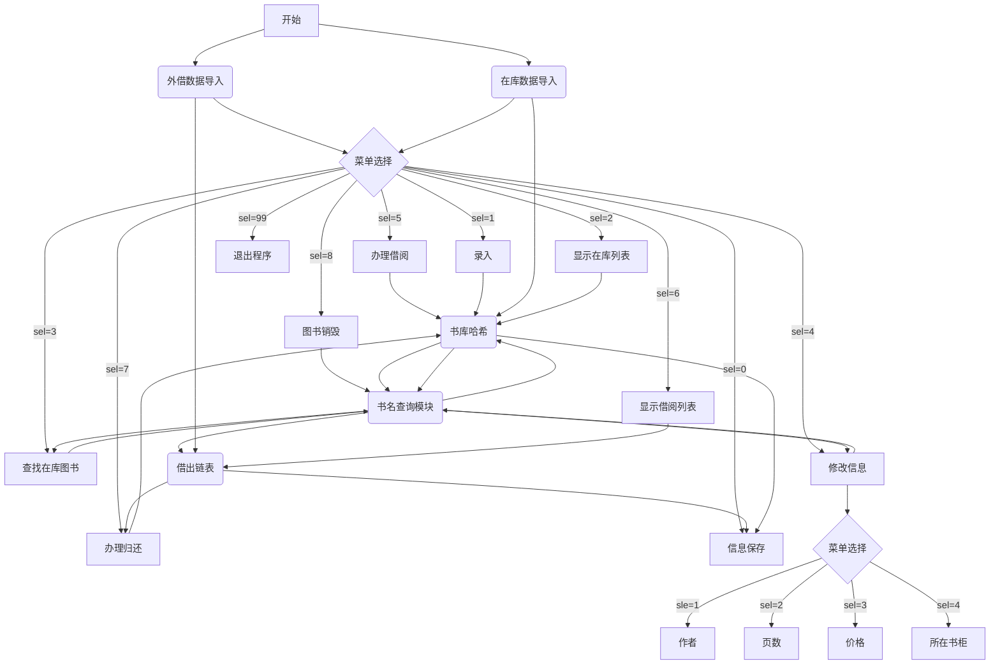

## 实现功能

该图书管理系统主要实现的是对五个书柜的图书实现录入，销毁，信息修改，所在位置查询，借阅及归还管理。

## 实现逻辑

### 结构

结构采用了哈希链表的结构，五个单链表组成哈希链表为在库图书信息数据结构，另设一个单链为借出图书信息数据结构。

### 实现逻辑框图

```mermaid
graph TD
A[开始]-->B(在库数据导入)
A-->D(外借数据导入)
D-->E{菜单选择}
B-->E{菜单选择}
E-->|sel=1|F[录入]
E-->|sel=2|G[显示在库列表]
E-->|sel=3|H[查找在库图书]
E-->|sel=4|I[修改信息]
E-->|sel=5|J[办理借阅]
E-->|sel=6|K[显示借阅列表]
E-->|sel=7|L[办理归还]
E-->|sel=8|M[图书销毁]
E-->|sel=0|N[信息保存]
E-->|sel=99|O[退出程序]
H-->P(书名查询模块)
I-->P-->X
M-->P
P-->H
P-->I
I-->R{菜单选择}
R-->|sle=1|S[作者]
R-->|sel=2|T[页数]
R-->|sel=3|U[价格]
R-->|sel=4|V[所在书柜]
J-->X-->P-->W(借出链表)
W-->L-->X
F-->X(书库哈希)
X-->P
B-->X
D-->W
G-->X
K-->W
W-->N
X-->N
```