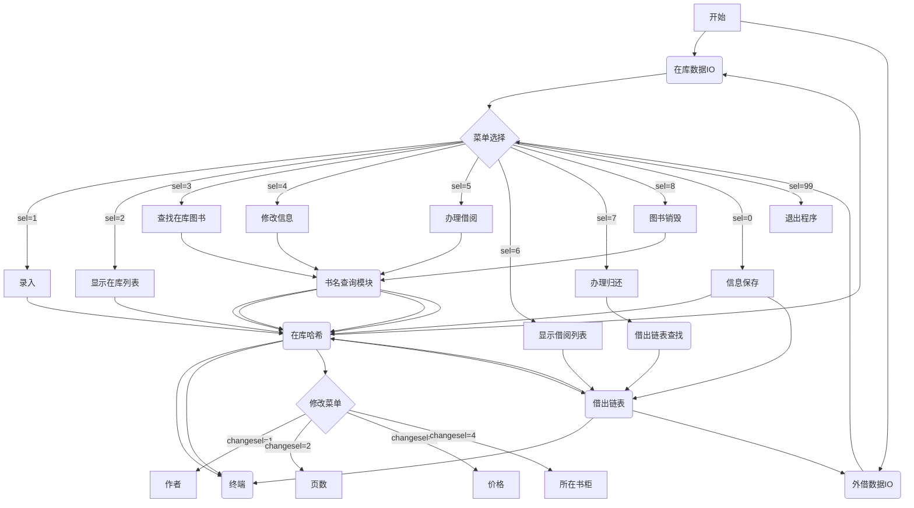

# 系统设计概要

## 实现功能

该图书管理系统主要实现的是对五个书柜的图书的录入，销毁，信息修改，所在书柜位置查询，图书借阅及归还管理。

## 实现逻辑

### 结构

分为在库图书和外界图书两部分数据，在库图书信息数据结构是五个单链表组成哈希链表，外借图书信息数据结构是一个单链组成的数据结构。

### 实现逻辑框图

```mermaid
graph TD
A[开始]-->B(在库数据IO)
A-->D(外借数据IO)
D-->E{菜单选择}
B-->E{菜单选择}
E-->|sel=1|F[录入]-->X(在库哈希)
E-->|sel=2|G[显示在库列表]-->X-->Z(终端)
E-->|sel=3|H[查找在库图书]-->P(书名查询模块)-->X-->Z
E-->|sel=4|I[修改信息]-->P-->X-->R{修改菜单}
R-->|changesel=1|S[作者]
R-->|changesel=2|T[页数]
R-->|changesel=3|U[价格]
R-->|changesel=4|V[所在书柜]
E-->|sel=5|J[办理借阅]-->P-->X-->W(借出链表)
E-->|sel=6|K[显示借阅列表]-->W-->Z
E-->|sel=7|L[办理归还]-->a(借出链表查找)-->W-->X
E-->|sel=8|M[图书销毁]-->P-->X
E-->|sel=0|N[信息保存]-->X-->B
N-->W-->D
E-->|sel=99|O[退出程序]
```
