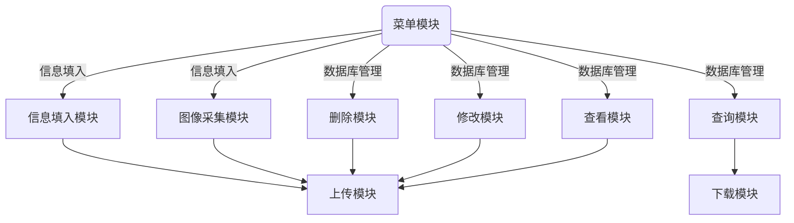
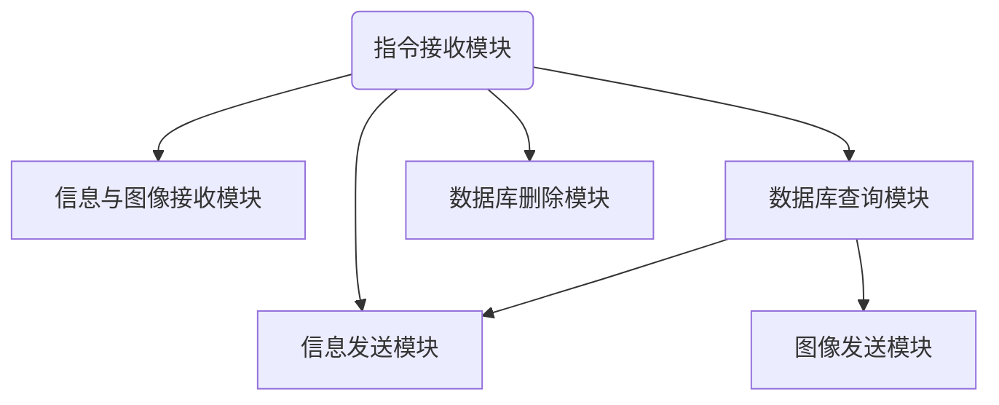

# 基于TCP协议和SQlite数据库的图片信息采集系统

[toc]

## 功能描述

客户端上传信息或者进行数据库操作，上传信息功能分为信息上传和图像上传；数据库操作分为查看数据库所有信息，查询指定信息并选择是否下载图像，修改指定信息，删除指定信息。服务器允许多用户并发上传。

## 模块划分

客户端：

1. 菜单模块，选择信息采集还是数据库操作。
2. 查看模块，从数据库拉取信息列表但图像不下载。
3. 查询模块，将要查询的信息发送给服务器，再接收服务器回传的信息。
4. 修改模块，将需要修改的信息发送给服务器。
5. 删除模块，将需要删除的信息发送给服务器。
6. 信息填入模块，让用户填写所需要采集的各类信息。
7. 图像采集模块，让用户选择需要上传的图像。（或者调用Linux摄像头采集）。
8. 上传模块，将各类信息和图像上传至服务器。
9. 下载模块，由查询模块调用，下载查询到的图片。

服务器：

1. 信息与图像接收模块。负责信息与图像接收与录入。
2. 数据库查询模块，以及其他需要使用查询功能的
3. 数据库修改模块，接收客户端修改指令，修改数据库内容。
4. 数据库删除模块，接收客户端删除指令，删除数据库内容。
5. 信息发送模块，将客户端所需要的信息发给客户端。
6. 图像发送模块，将客户端要查询的图像发送给客户端。
7. 指令接收模块，用于接收客户端发出的指令。

## 模块关系图

### 客户端

### 服务器

