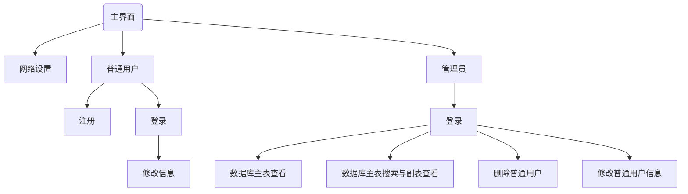

# 基于Qt和TCPIP技术的打卡管理系统

[toc]

## 功能目标

实现服务器与客户端的通信，Qt图形界面客户端可以进行管理员登录及其附加功能操作和普通用户的登陆注册及其附加功能操作。

## 客户端功能框架

```mermaid
graph TD
a(主界面)-->b[网络设置]
a-->c[普通用户]-->d[注册]
c-->e[登录]-->f[修改信息]
a-->g[管理员]-->h[登录]-->i[数据库主表查看]
h-->j[数据库主表搜索与副表查看]
h-->k[删除普通用户]
h-->l[修改普通用户信息]
```
