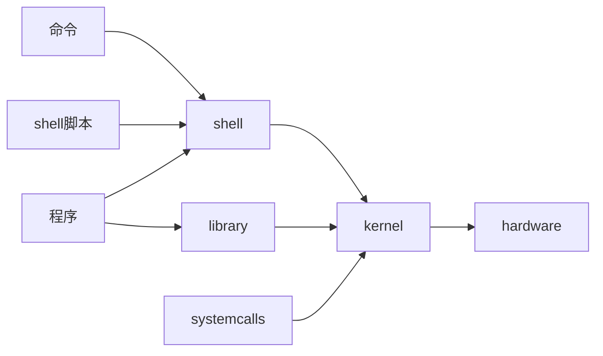

[toc]

# Linux系统结构

## kernel

Linux是宏内核操作系统（所有的操作交给内核去执行），内核的系统调用负责：
|管理项目|具体内容
|-|-
|文件系统管理|不同的文件系统之间的数据交互
|网络管理|进程之间的通信
|进程管理|管理不同进程之间的调度
|内存管理|管理着虚拟内存和物理内存之间的映射
|硬件管理|控制着不同设备之间的运转

## shell

shell是一个命令行解释器，命令行提示符输入了字符串之后，shell会告诉内核去PATH中的文件夹里找和字符串相同的可执行文件。如果文件存在执行对应的文件的操作，如果不存在命令错误。
